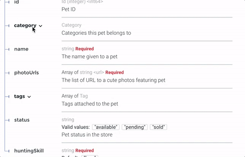
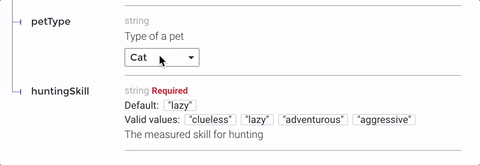
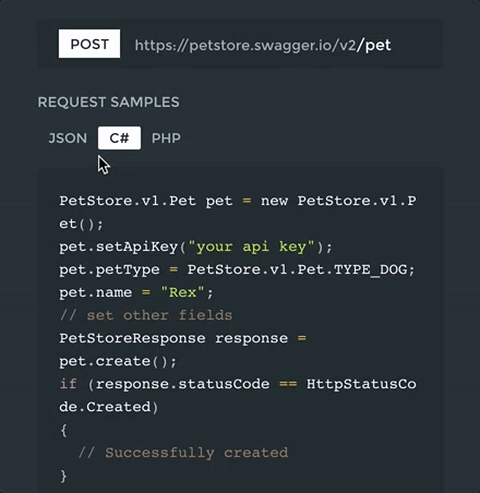

<div align="center">
  

  # Generate interactive API documentation from OpenAPI definitions

  [](https://coveralls.io/github/Redocly/redoc?branch=main) [](https://www.npmjs.com/package/redoc) [](https://github.com/Redocly/redoc/blob/main/LICENSE)

  [](https://cdn.redoc.ly/redoc/latest/bundles/redoc.standalone.js) [](https://www.npmjs.com/package/redoc) [](https://www.jsdelivr.com/package/npm/redoc) [](https://hub.docker.com/r/redocly/redoc/)
</div>

**This is the README for the `2.x` version of Redoc (React-based).**
**The README for the `1.x` version is on the [v1.x](https://github.com/Redocly/redoc/tree/v1.x) branch**

## About Redoc

Redoc is an open-source tool for generating documentation from OpenAPI (fka Swagger) definitions.

By default Redoc offers a three-panel, responsive layout:

- The left panel contains a search bar and navigation menu.
- The central panel contains the documentation.
- The right panel contains request and response examples.


## Live demo

If you want to see how Redoc will render your OpenAPI definition,
you can try it out online at https://redocly.github.io/redoc/.

A version of the Swagger Petstore API is displayed by default.
To test it with your own OpenAPI definition,
enter the URL for your definition and select **TRY IT**.

## Redoc vs. Reference vs. Portals

Redoc is Redocly's community-edition product. Looking for something more?
Checkout the following feature comparison of Redocly's premium products versus Redoc:

| Features                     | Redoc     | Reference | Portals     |
|------------------------------|:---------:|:---------:|:-----------:|
| **Specs**                    |           |           |             |
| Swagger 2.0                  | √         | √         | √           |
| OpenAPI 3.0                  | √         | √         | √           |
| OpenAPI 3.1                  | √ (basic) | √         | √           |
|                              |           |           |             |
| **Theming**                  |           |           |             |
| Fonts/colors                 | √         | √         | √           |
| Extra theme options          |           | √         | √           |
|                              |           |           |             |
| **Performance**              |           |           |             |
| Pagination                   |           | √         | √           |
| Search (enhanced)            |           | √         | √           |
| Search (server-side)         |           |           | √           |
|                              |           |           |             |
| **Multiple APIs**            |           |           |             |
| Multiple versions            |           | √         | √           |
| Multiple APIs                |           |           | √           |
| API catalog                  |           |           | √           |
|                              |           |           |             |
| **Additional features**      |           |           |             |
| Try-it console               |           | √         | √           |
| Automated code samples       |           | √         | √           |
| Deep links                   |           | √         | √           |
| More SEO control             |           |           | √           |
| Contextual docs              |           |           | √           |
| Landing pages                |           |           | √           |
| React hooks for more control |           |           | √           |
| Personalization              |           |           | √           |
| Analytics integrations       |           |           | √           |
| Feedback                     |           |           | Coming Soon |

Refer to the Redocly's documentation for more information on these products:

- [Portals](https://redoc.ly/docs/developer-portal/introduction/)
- [Reference](https://redoc.ly/docs/api-reference-docs/getting-started/)
- [Redoc](https://redoc.ly/docs/redoc/quickstart/intro/)

## Features
- Responsive three-panel design with menu/scrolling synchronization
- [Multiple deployment options](https://redoc.ly/docs/redoc/quickstart/intro/)
- [Server-side rendering (SSR) ready](https://redoc.ly/docs/redoc/quickstart/cli/#redoc-cli-commands)
- Ability to integrate your API introduction into the side menu
- [Simple integration with `create-react-app`](https://redoc.ly/docs/redoc/quickstart/react/)

  [Example repo](https://github.com/APIs-guru/create-react-app-redoc)
- [Command-line interface to bundle your docs into a **zero-dependency** HTML file](https://redoc.ly/docs/redoc/quickstart/cli/)
- Neat **interactive** documentation for nested objects <br>
  

## Customization options
[](https://redoc.ly/#services)
- High-level grouping in side-menu with the [`x-tagGroups`](https://redoc.ly/docs/api-reference-docs/specification-extensions/x-tag-groups/) specification extension
- Branding/customizations using the [`theme` option](https://redoc.ly/docs/api-reference-docs/configuration/theming/)

## Support
- OpenAPI v3.0 support
- Basic OpenAPI v3.1 support
- Broad OpenAPI v2.0 feature support (yes, it supports even `discriminator`) <br>
  
- Code samples support (via vendor extension) <br>
  

## Releases
**Important:** all the 2.x releases are deployed to npm and can be used with Redocly-cdn:
- particular release, for example, `v2.0.0-rc.70`: https://cdn.redoc.ly/redoc/v2.0.0-rc.70/bundles/redoc.standalone.js
- `latest` release: https://cdn.redoc.ly/redoc/latest/bundles/redoc.standalone.js

Additionally, all the 1.x releases are hosted on our GitHub Pages-based CDN **(deprecated)**:
- particular release, for example `v1.2.0`: https://rebilly.github.io/ReDoc/releases/v1.2.0/redoc.min.js
- `v1.x.x` release: https://rebilly.github.io/ReDoc/releases/v1.x.x/redoc.min.js
- `latest` release: https://rebilly.github.io/ReDoc/releases/latest/redoc.min.js - it will point to latest 1.x.x release since 2.x releases are not hosted on this CDN but on unpkg.

## Version Guidance
| Redoc Release | OpenAPI Specification |
|:--------------|:----------------------|
| 2.0.0-alpha.54| 3.1, 3.0.x, 2.0       |
| 2.0.0-alpha.x | 3.0, 2.0              |
| 1.19.x        | 2.0                   |
| 1.18.x        | 2.0                   |
| 1.17.x        | 2.0                   |

## Showcase
- [Rebilly](https://api-reference.rebilly.com/)
- [Docker Engine](https://docs.docker.com/engine/api/v1.25/)
- [Zuora](https://www.zuora.com/developer/api-reference/)
- [Discourse](http://docs.discourse.org)
- [Commbox](https://www.commbox.io/api/)
- [APIs.guru](https://apis.guru/api-doc/)
- [BoxKnight](https://www.docs.boxknight.com/)

## Lint OpenAPI definitions

Redocly's CLI is an [open source command-line tool](https://github.com/Redocly/redocly-cli) that you can use to lint
your OpenAPI definition. Linting helps you to catch errors and inconsistencies in your
OpenAPI definition before publishing.

Refer to [Redocly configuration](https://redocly.com/docs/cli/configuration/) in the OpenAPI documentation for more information.

## Deployment

### TL;DR final code example

To render your OpenAPI definition using Redoc, use the following HTML code sample and
replace the `spec-url` attribute with the url or local file address to your definition.

```html
<!DOCTYPE html>
<html>
  <head>
    <title>Redoc</title>
    <!-- needed for adaptive design -->
    <meta charset="utf-8"/>
    <meta name="viewport" content="width=device-width, initial-scale=1">
    <link href="https://fonts.googleapis.com/css?family=Montserrat:300,400,700|Roboto:300,400,700" rel="stylesheet">

    <!--
    Redoc doesn't change outer page styles
    -->
    <style>
      body {
        margin: 0;
        padding: 0;
      }
    </style>
  </head>
  <body>
    <redoc spec-url='http://petstore.swagger.io/v2/swagger.json'></redoc>
    <script src="https://cdn.redoc.ly/redoc/latest/bundles/redoc.standalone.js"> </script>
  </body>
</html>

```

For step-by-step instructions for how to get started using Redoc
to render your OpenAPI definition, refer to the
[**Redoc quickstart guide**](https://redocly.com/docs/redoc/quickstart/) and [**How to use the HTML element**](https://redocly.com/docs/redoc/deployment/html/).

## Redoc CLI
For more information on Redoc's commmand-line interface, refer to
[**Using the Redoc CLI**](https://redocly.com/docs/redoc/deployment/cli/).


## Configuration

### Security Definition location
You can inject the Security Definitions widget into any place in your definition `description`.
For more information, refer to [Security definitions injection](docs/security-definitions-injection.md).

### OpenAPI specification extensions
Redoc uses the following [specification extensions](https://redocly.com/docs/api-reference-docs/spec-extensions/):
* [`x-logo`](docs/redoc-vendor-extensions.md#x-logo) - is used to specify API logo
* [`x-traitTag`](docs/redoc-vendor-extensions.md#x-traitTag) - useful for handling out common things like Pagination, Rate-Limits, etc
* [`x-codeSamples`](docs/redoc-vendor-extensions.md#x-codeSamples) - specify operation code samples
* [`x-examples`](docs/redoc-vendor-extensions.md#x-examples) - specify JSON example for requests
* [`x-nullable`](docs/redoc-vendor-extensions.md#x-nullable) - mark schema param as a nullable
* [`x-displayName`](docs/redoc-vendor-extensions.md#x-displayname) - specify human-friendly names for the menu categories
* [`x-tagGroups`](docs/redoc-vendor-extensions.md#x-tagGroups) - group tags by categories in the side menu
* [`x-servers`](docs/redoc-vendor-extensions.md#x-servers) - ability to specify different servers for API (backported from OpenAPI 3.0)
* [`x-ignoredHeaderParameters`](docs/redoc-vendor-extensions.md#x-ignoredHeaderParameters) - ability to specify header parameter names to ignore
* [`x-additionalPropertiesName`](docs/redoc-vendor-extensions.md#x-additionalPropertiesName) - ability to supply a descriptive name for the additional property keys
* [`x-summary`](docs/redoc-vendor-extensions.md#x-summary) - For Response object, use as the response button text, with description rendered under the button
* [`x-extendedDiscriminator`](docs/redoc-vendor-extensions.md#x-extendedDiscriminator) - In Schemas, uses this to solve name-clash issues with the standard discriminator
* [`x-explicitMappingOnly`](docs/redoc-vendor-extensions.md#x-explicitMappingOnly) - In Schemas, display a more descriptive property name in objects with additionalProperties when viewing the property list with an object

### `<redoc>` options object
You can use all of the following options with the standalone version of the <redoc> tag by kebab-casing them. For example, `scrollYOffset` becomes `scroll-y-offset`, and `expandResponses` becomes `expand-responses`.

* `disableSearch` - disable search indexing and search box.
* `minCharacterLengthToInitSearch` - set minimal characters length to init search, default `3`, minimal `1`.
* `expandDefaultServerVariables` - enable expanding default server variables, default `false`.
* `expandResponses` - specify which responses to expand by default by response codes. Values should be passed as comma-separated list without spaces e.g. `expandResponses="200,201"`. Special value `"all"` expands all responses by default. Be careful: this option can slow-down documentation rendering time.
* `generatedPayloadSamplesMaxDepth` - set the maximum render depth for JSON payload samples (responses and request body). The default value is `10`.
* `maxDisplayedEnumValues` - display only specified number of enum values. hide rest values under spoiler.
* `hideDownloadButton` - do not show "Download" spec button. **THIS DOESN'T MAKE YOUR SPEC PRIVATE**, it just hides the button.
* `downloadFileName` - set a custom file name for the downloaded API definition file.
* `downloadDefinitionUrl` - If the 'Download' button is visible in the API reference documentation (hideDownloadButton=false), the URL configured here will open when that button is selected. Provide it as an absolute URL with the full URI scheme.
* `hideHostname` - if set, the protocol and hostname is not shown in the operation definition.
* `hideLoading` - do not show loading animation. Useful for small docs.
* `hideFab` - do not show FAB in mobile view. Useful for implementing a custom floating action button.
* `hideSchemaPattern` - if set, the pattern is not shown in the schema.
* `hideSingleRequestSampleTab` - do not show the request sample tab for requests with only one sample.
* `showObjectSchemaExamples` - show object schema example in the properties, default `false`.
* `expandSingleSchemaField` - automatically expand single field in a schema
* `schemaExpansionLevel` - specifies whether to automatically expand schemas. Special value `"all"` expands all levels. The default value is `0`.
* `jsonSampleExpandLevel` - set the default expand level for JSON payload samples (responses and request body). Special value `"all"` expands all levels. The default value is `2`.
* `hideSchemaTitles` - do not display schema `title` next to to the type
* `simpleOneOfTypeLabel` - show only unique oneOf types in the label without titles
* `sortEnumValuesAlphabetically` - set to true, sorts all enum values in all schemas alphabetically
* `sortOperationsAlphabetically` - set to true, sorts operations in the navigation sidebar and in the middle panel alphabetically
* `sortTagsAlphabetically` - set to true, sorts tags in the navigation sidebar and in the middle panel alphabetically
* `lazyRendering` - _Not implemented yet_ ~~if set, enables lazy rendering mode in ReDoc. This mode is useful for APIs with big number of operations (e.g. > 50). In this mode ReDoc shows initial screen ASAP and then renders the rest operations asynchronously while showing progress bar on the top. Check out the [demo](\\redocly.github.io/redoc) for the example.~~
* `menuToggle` - if true clicking second time on expanded menu item will collapse it, default `true`.
* `nativeScrollbars` - use native scrollbar for sidemenu instead of perfect-scroll (scrolling performance optimization for big specs).
* `onlyRequiredInSamples` - shows only required fields in request samples.
* `pathInMiddlePanel` - show path link and HTTP verb in the middle panel instead of the right one.
* `requiredPropsFirst` - show required properties first ordered in the same order as in `required` array.
* `scrollYOffset` - If set, specifies a vertical scroll-offset. This is often useful when there are fixed positioned elements at the top of the page, such as navbars, headers etc;
`scrollYOffset` can be specified in various ways:
  * **number**: A fixed number of pixels to be used as offset.
  * **selector**: selector of the element to be used for specifying the offset. The distance from the top of the page to the element's bottom will be used as offset.
  * **function**: A getter function. Must return a number representing the offset (in pixels).
* `showExtensions` - show vendor extensions ("x-" fields). Extensions used by ReDoc are ignored. Can be boolean or an array of `string` with names of extensions to display.
* `sortPropsAlphabetically` - sort properties alphabetically.
* `payloadSampleIdx` - if set, payload sample will be inserted at this index or last. Indexes start from 0.
* `theme` - ReDoc theme. For details check [theme docs](#redoc-theme-object).
* `untrustedSpec` - if set, the spec is considered untrusted and all HTML/markdown is sanitized to prevent XSS. **Disabled by default** for performance reasons. **Enable this option if you work with untrusted user data!**
* `nonce` - if set, the provided value will be injected in every injected HTML element in the `nonce` attribute. Useful when using CSP, see https://webpack.js.org/guides/csp/.
* `sideNavStyle` - can be specified in various ways:
  * **summary-only**: displays a summary in the sidebar navigation item. (**default**)
  * **path-only**: displays a path in the sidebar navigation item.
  * **id-only**: displays the operation id with a fallback to the path in the sidebar navigation item.
* `showWebhookVerb` - when set to `true`, shows the HTTP request method for webhooks in operations and in the sidebar.

### `<redoc>` theme object
* `spacing`
  * `unit`: 5 # main spacing unit used in autocomputed theme values later
  * `sectionHorizontal`: 40 # Horizontal section padding. COMPUTED: spacing.unit * 8
  * `sectionVertical`: 40 # Horizontal section padding. COMPUTED: spacing.unit * 8
* `breakpoints` # breakpoints for switching three/two and mobile view layouts
  * `small`: '50rem'
  * `medium`: '85rem'
  * `large`: '105rem'
* `colors`
  * `tonalOffset`: 0.3 # default tonal offset used in computations
* `typography`
  * `fontSize`: '14px'
  * `lineHeight`: '1.5em'
  * `fontWeightRegular`: '400'
  * `fontWeightBold`: '600'
  * `fontWeightLight`: '300'
  * `fontFamily`: 'Roboto, sans-serif'
  * `smoothing`: 'antialiased'
  * `optimizeSpeed`: true
  * `headings`
    * `fontFamily`: 'Montserrat, sans-serif'
    * `fontWeight`: '400'
    * `lineHeight`: '1.6em'
  * `code` # inline code styling
    * `fontSize`: '13px'
    * `fontFamily`: 'Courier, monospace'
    * `lineHeight`: # COMPUTED: typography.lineHeight
    * `fontWeight`: # COMPUTED: typography.fontWeightRegular
    * `color`: '#e53935'
    * `backgroundColor`: 'rgba(38, 50, 56, 0.05)'
    * `wrap`: false # whether to break word for inline blocks (otherwise they can overflow)
  * `links`
    * `color`: # COMPUTED: colors.primary.main
    * `visited`: # COMPUTED: typography.links.color
    * `hover`: # COMPUTED: lighten(0.2 typography.links.color)
    * `textDecoration`: 'auto'
    * `hoverTextDecoration`: 'auto'
* `sidebar`
  * `width`: '260px'
  * `backgroundColor`: '#fafafa'
  * `textColor`: '#333333'
  * `activeTextColor`: # COMPUTED: theme.sidebar.textColor (if set by user) or theme.colors.primary.main
  * `groupItems` # Group headings
    * `activeBackgroundColor`: # COMPUTED: theme.sidebar.backgroundColor
    * `activeTextColor`: # COMPUTED: theme.sidebar.activeTextColor
    * `textTransform`: 'uppercase'
  * `level1Items` # Level 1 items like tags or section 1st level items
    * `activeBackgroundColor`: # COMPUTED: theme.sidebar.backgroundColor
    * `activeTextColor`: # COMPUTED: theme.sidebar.activeTextColor
    * `textTransform`: 'none'
  * `arrow` # sidebar arrow
    * `size`: '1.5em'
    * `color`: # COMPUTED: theme.sidebar.textColor
* `logo`
  * `maxHeight`: # COMPUTED: sidebar.width
  * `maxWidth`: # COMPUTED: sidebar.width
  * `gutter`: '2px' # logo image padding
* `rightPanel`
  * `backgroundColor`: '#263238'
  * `width`: '40%'
  * `textColor`: '#ffffff'
  * `servers`
    * `overlay`
      * `backgroundColor`: '#fafafa'
      * `textColor`: '#263238'
    * `url`
      * `backgroundColor`: '#fff'
* `fab`
  * `backgroundColor`: '#263238'
  * `color`: '#ffffff'

-----------
## Development
see [CONTRIBUTING.md](.github/CONTRIBUTING.md)
