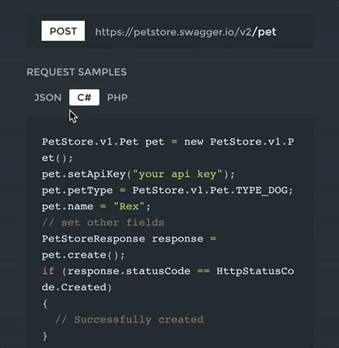

<div align="center">
  

# Generate beautiful API documentation from OpenAPI

  [](https://www.npmjs.com/package/redoc) [](https://github.com/Redocly/redoc/blob/main/LICENSE)

  [](https://cdn.redoc.ly/redoc/latest/bundles/redoc.standalone.js) [](https://www.npmjs.com/package/redoc) [](https://www.jsdelivr.com/package/npm/redoc)
</div>


## About Redoc

Redoc is an open source tool for generating documentation from OpenAPI (formerly Swagger) definitions.

By default Redoc offers a three-panel, responsive layout:

- The left panel contains a search bar and navigation menu.
- The central panel contains the documentation.
- The right panel contains request and response examples.


## Live demo

If you want to see how Redoc renders your OpenAPI definition,
you can try it out online at https://redocly.github.io/redoc/.

A version of the Swagger Petstore API is displayed by default.
To test it with your own OpenAPI definition,
enter the URL for your definition and select **TRY IT**.

## Redoc features

- Responsive three-panel design with menu/scrolling synchronization
- Support for OpenAPI 3.1, OpenAPI 3.0, and Swagger 2.0
- Ability to integrate your API introduction into the side menu
- High-level grouping in side menu with the [`x-tagGroups`](https://redocly.com/docs/api-reference-docs/specification-extensions/x-tag-groups/) specification extension
- [Simple integration with `create-react-app`](https://redocly.com/docs/redoc/quickstart/react/)
- Code samples support (with vendor extension) <br>
  

## Usage

Redoc is provided as a CLI tool (also distributed as a Docker image), HTML tag, and React component.

### Generate documentation from the CLI

If you have Node installed, quickly generate documentation using `npx`:

```bash
npx @redocly/cli build-docs openapi.yaml
```

The tool outputs by default to a file named `redoc-static.html` that you can open in your browser.

> [Redocly CLI](https://github.com/Redocly/redocly-cli/) does more than docs; check it out and add linting, bundling, and more to your API workflow.

### Add an HTML element to the page

Create an HTML page, or edit an existing one, and add the following within the body tags:

```html
    <redoc spec-url="http://petstore.swagger.io/v2/swagger.json"></redoc>
    <script src="https://cdn.redoc.ly/redoc/latest/bundles/redoc.standalone.js"> </script>
```

Open the HTML file in your browser, and your API documentation is shown on the page.

Add your own `spec-url` to the `<redoc>` tag; this attribute can also be a local file. The JavaScript library can also be installed locally using `npm` and served from your own server, see the [HTML deployment documentation](https://redocly.com/docs/redoc/deployment/html/) for more details.

### More usage options

Check out the [deployment documentation](./docs/deployment/intro.md) for more options, and detailed documentation for each.

## Redoc vs. Redocly API Reference

Redoc is Redocly's community-edition product. Looking for something more?
We also offer [hosted API reference documentation](https://redocly.com/docs/api-registry/guides/api-registry-quickstart/)
with additional features including:

* Try-it console
* Automated code samples
* Pagination
* Extra theme options

### Documentation and resources

- [Reference docs](https://redocly.com/docs/api-reference-docs/getting-started/) - we take care of the hosting
- [Redoc](https://redocly.com/docs/redoc/) - detailed documentation for this open source project (also in the `docs/` folder)
- [Command-line interface to bundle your docs into a web-ready HTML file](https://redocly.com/docs/cli/commands/build-docs/)
- API linting, bundling, and much more with open source [Redocly CLI](https://redocly.com/docs/cli)

## Showcase

A sample of the organizations using Redocly tools in the wild:

- [Rebilly](https://api-reference.rebilly.com/)
- [Docker Engine](https://docs.docker.com/engine/api/v1.25/)
- [Zuora](https://www.zuora.com/developer/api-reference/)
- [Discourse](http://docs.discourse.org)
- [Commbox](https://www.commbox.io/api/)
- [APIs.guru](https://apis.guru/api-doc/)
- [BoxKnight](https://www.docs.boxknight.com/)
- [Quaderno API](https://developers.quaderno.io/api)

_Pull requests to add your own API page to the list are welcome_

## Configuration

Redoc is highly configurable, see the [configuration documentation](docs/config.md) for details.

### OpenAPI specification extensions
Redoc uses the following [specification extensions](https://redocly.com/docs/api-reference-docs/spec-extensions/):

* [`x-logo`](docs/redoc-vendor-extensions.md#x-logo) - is used to specify API logo
* [`x-traitTag`](docs/redoc-vendor-extensions.md#x-traitTag) - useful for tags that refer to non-navigation properties like Pagination, Rate-Limits, etc
* [`x-codeSamples`](docs/redoc-vendor-extensions.md#x-codeSamples) - specify operation code samples
* [`x-badges`](docs/redoc-vendor-extensions.md#x-badges) - specify operation badges
* [`x-examples`](docs/redoc-vendor-extensions.md#x-examples) - specify JSON example for requests
* [`x-nullable`](docs/redoc-vendor-extensions.md#x-nullable) - mark schema param as a nullable
* [`x-displayName`](docs/redoc-vendor-extensions.md#x-displayname) - specify human-friendly names for the menu categories
* [`x-tagGroups`](docs/redoc-vendor-extensions.md#x-tagGroups) - group tags by categories in the side menu
* [`x-servers`](docs/redoc-vendor-extensions.md#x-servers) - ability to specify different servers for API (backported from OpenAPI 3.0)
* [`x-additionalPropertiesName`](docs/redoc-vendor-extensions.md#x-additionalPropertiesName) - ability to supply a descriptive name for the additional property keys
* [`x-summary`](docs/redoc-vendor-extensions.md#x-summary) - for Response object, use as the response button text, with description rendered under the button
* [`x-explicitMappingOnly`](docs/redoc-vendor-extensions.md#x-explicitMappingOnly) - in Schemas, display a more descriptive property name in objects with additionalProperties when viewing the property list with an object

## Releases

**The README for the `1.x` version is on the [v1.x](https://github.com/Redocly/redoc/tree/v1.x) branch.**

All 2.x releases are deployed to npm and can be used with Redocly CDN:
- particular release, for example, `v2.0.0`: https://cdn.redoc.ly/redoc/v2.0.0/bundles/redoc.standalone.js
- `latest` release: https://cdn.redoc.ly/redoc/latest/bundles/redoc.standalone.js

> **Note:** The 1.x CDN at `rebilly.github.io` is deprecated. Please use the latest 2.x releases from `cdn.redoc.ly`.

## Troubleshooting

### Common Issues

**Q: My API documentation is not displaying correctly**
- Ensure your OpenAPI spec is valid JSON or YAML and follows OpenAPI 3.0, 3.1, or Swagger 2.0 format
- Check browser console for errors using Developer Tools (F12)
- Verify that your `spec-url` points to a valid, accessible endpoint
- For local files, ensure they're being served via a web server (not `file://`)

**Q: Search is not working**
- Confirm that `disableSearch` is not enabled in your Redoc configuration
- Check that your search term meets the configured `minCharacterLengthToInitSearch` value

**Q: Performance is slow with large OpenAPI specs**
- Consider using the [Redocly CLI](https://redocly.com/docs/cli/) to split your spec into smaller, manageable files
- Check the [configuration documentation](docs/config.md) for options such as `disableSearch` and `jsonSamplesExpandLevel`

**Q: How do I customize the appearance?**
- See the [configuration documentation](docs/config.md) for theming and customization options
- For advanced customization, you can use the [React component](https://redocly.com/docs/redoc/quickstart/react/) with custom CSS

For additional help, please check the [official documentation](https://redocly.com/docs/redoc/) or open an issue on [GitHub](https://github.com/Redocly/redoc/issues).

## Development
see [CONTRIBUTING.md](.github/CONTRIBUTING.md)
