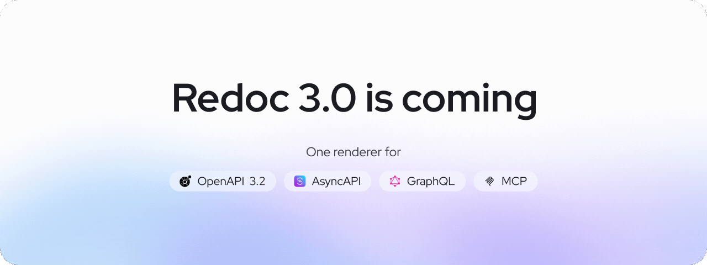
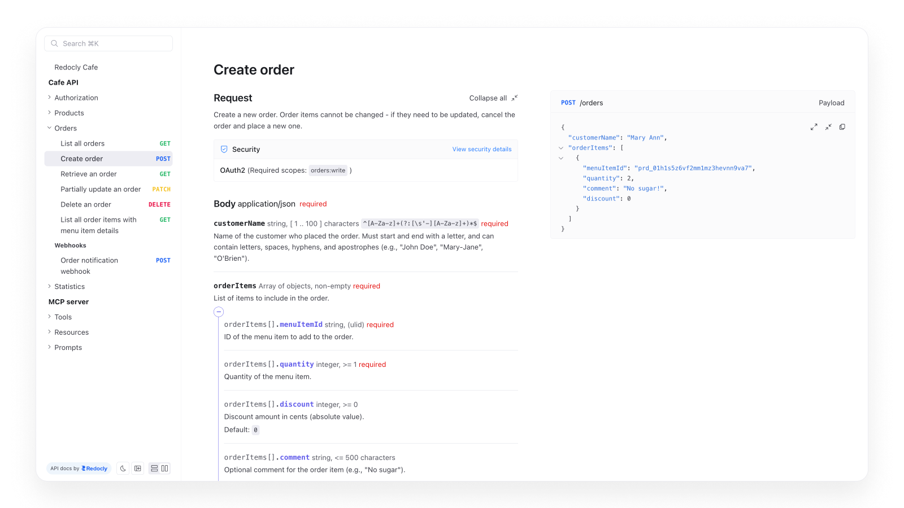

<div align="center">
<<<<<<< HEAD
=======

  <a href="https://redocly.com/redoc-ce">
    <picture>
      <source media="(prefers-color-scheme: dark)" srcset="./docs/images/redoc-3-announcement-dark.gif">
      <source media="(prefers-color-scheme: light)" srcset="./docs/images/redoc-3-announcement-light.gif">
      
    </picture>
  </a>

  **[Learn what's coming in Redoc 3.x →](https://redocly.com/redoc-ce)**


>>>>>>> origin

  <a href="https://redocly.com/redoc-ce">
    <picture>
      <source media="(prefers-color-scheme: dark)" srcset="./images/redoc-3-announcement-dark.gif">
      <source media="(prefers-color-scheme: light)" srcset="./images/redoc-3-announcement-light.gif">
      
    </picture>
  </a>

  **[Learn what's new in Redoc 3.x →](https://redocly.com/redoc-ce)**


# Generate beautiful API documentation from OpenAPI, AsyncAPI, and GraphQL

  [](https://www.npmjs.com/package/redoc) [](https://github.com/Redocly/redoc/blob/main/LICENSE)

  [](https://www.npmjs.com/package/redoc) [](https://www.jsdelivr.com/package/npm/redoc)
</div>


## About Redoc

Redoc is an open source tool for generating documentation from OpenAPI (formerly Swagger), AsyncAPI, and GraphQL definitions.

By default Redoc offers a three-panel, responsive layout:

- The left panel contains a search bar and navigation menu.
- The central panel contains the documentation.
- The right panel contains request and response examples.

<picture>
  <source media="(prefers-color-scheme: dark)" srcset="./images/demo-dark.png">
  <source media="(prefers-color-scheme: light)" srcset="./images/demo-light.png">
  
</picture>

## Live demo

If you want to see how Redoc renders your API definition,
you can try it out online at https://redocly.github.io/redoc/.

A version of the Redocly Cafe API is displayed by default.
To test it with your own API definition,
enter the URL for your definition and select **TRY IT**.

## Redoc features

- Responsive three-panel design with menu/scrolling synchronization
- Support for OpenAPI 3.2, OpenAPI 3.1, OpenAPI 3.0, and Swagger 2.0
- Support for AsyncAPI 3.x and GraphQL (SDL) — the format is detected from the document
- MCP (Model Context Protocol) server documentation with the [`x-mcp`](https://redocly.com/docs/realm/content/api-docs/openapi-extensions/x-mcp) specification extension
- Improved built-in search
- **Copy**, **Open in ChatGPT**, and **Open in Claude** actions on every page to work with the docs in your AI assistant
- Dark mode and theming with [CSS variables](https://redocly.com/docs/realm/branding/css-variables)
- Ability to integrate your API introduction into the side menu
- High-level grouping in side menu with the [`x-tagGroups`](https://redocly.com/docs/realm/content/api-docs/openapi-extensions/x-tag-groups) specification extension
- [Simple integration with React](https://redocly.com/docs/redoc/v3.x/deployment/react)
- Code samples support (with the `x-codeSamples` specification extension) <br>
  

## Usage

Redoc Community Edition is available as an HTML tag, a React component, and via the Redocly CLI (also distributed as a Docker image).

### Generate documentation from the CLI

If you have Node installed, quickly generate documentation using `npx`:

```bash
npx @redocly/cli build-docs openapi.yaml
```

The tool outputs by default to a file named `redoc-static.html` that you can open in your browser.

> [Redocly CLI](https://github.com/Redocly/redocly-cli/) does more than docs; check it out and add linting, bundling, and more to your API workflow.

### Add an HTML element to the page

Create an HTML page, or edit an existing one, and add the following within the body tags:

```html
    <redoc spec-url="https://example.com/openapi.yaml"></redoc>
    <script type="module" src="https://cdn.redoc.ly/redoc/v3.x/bundles/redoc.standalone.js"> </script>
```

Open the HTML file in your browser, and your API documentation is shown on the page.

Add your own `spec-url` to the `<redoc>` tag; this attribute can also be a local file, an AsyncAPI definition, or a GraphQL schema. The JavaScript library can also be installed locally using `npm` and served from your own server, see the [HTML deployment documentation](https://redocly.com/docs/redoc/v3.x/deployment/html) for more details.

### Use the React component

```tsx
import { RedocStandalone } from 'redoc';

<RedocStandalone specUrl="https://example.com/openapi.yaml" />;
```

### More usage options

Check out the [deployment documentation](https://redocly.com/docs/redoc/v3.x/deployment/intro) for more options, and detailed documentation for each.

<<<<<<< HEAD
## Redoc vs. hosted Redoc

Redoc is Redocly's community-edition product. Looking for something more?
We also offer [Redoc](https://redocly.com/redoc)
with support for specifications like SOAP and additional features including:
=======
## Redoc vs hosted Redoc

Redoc is Redocly's community-edition product. Looking for something more?
We also offer a [hosted Redoc](https://redocly.com/redoc)
with additional features including:
>>>>>>> origin

* Try-it panel (Replay)
* Automated code samples
<<<<<<< HEAD
* Mock server
* Feedback widgets
* Role-based access control
* Full customization
* Lint

### Documentation and resources

- [Realm + Reunite](https://redocly.com/docs/realm) - we take care of the hosting, which includes everything you need for documentation.
- [Redoc](https://redocly.com/docs/redoc/v3.x) - detailed documentation for this open source project
=======
* Fully custom styles
* Mock server
* AsyncAPI
* GraphQL

### Documentation and resources

- [Realm](https://redocly.com/docs/realm/) - we take care of the hosting
- [Redoc](https://redocly.com/docs/redoc/) - detailed documentation for this open source project (also in the `docs/` folder)
>>>>>>> origin
- [Command-line interface to bundle your docs into a web-ready HTML file](https://redocly.com/docs/cli/commands/build-docs/)
- API linting, bundling, and much more with open source [Redocly CLI](https://redocly.com/docs/cli)

## Showcase

A sample of the organizations using Redocly tools in the wild:

- [Rebilly](https://api-reference.rebilly.com/)
- [Docker Engine](https://docs.docker.com/reference/api/engine/version/v1.56/)
- [Zuora](https://developer.zuora.com/v1-api-reference/api)
- [Discourse](https://docs.discourse.org)
- [APIs.guru](https://apis.guru/api-doc/)
- [BoxKnight](https://www.docs.boxknight.com/)
- [Quaderno API](https://developers.quaderno.io/api)

_Pull requests to add your own API page to the list are welcome_

## Configuration

Redoc is highly configurable, see the [configuration documentation](https://redocly.com/docs/redoc/v3.x/config) for details.

### OpenAPI specification extensions
Redoc uses the following [specification extensions](https://redocly.com/docs/realm/content/api-docs/openapi-extensions):

* [`x-logo`](https://redocly.com/docs/realm/content/api-docs/openapi-extensions) - is used to specify API logo
* [`x-traitTag`](https://redocly.com/docs/realm/content/api-docs/openapi-extensions/x-trait-tag) - useful for tags that refer to non-navigation properties like Pagination, Rate-Limits, etc
* [`x-codeSamples`](https://redocly.com/docs/realm/content/api-docs/openapi-extensions/x-code-samples) - specify operation code samples
* [`x-badges`](https://redocly.com/docs/realm/content/api-docs/openapi-extensions/x-badges) - specify operation badges
* [`x-enumDescriptions`](https://redocly.com/docs/realm/content/api-docs/openapi-extensions/x-enum-descriptions) - list of the enum values and descriptions to include in the documentation
* [`x-examples`](https://redocly.com/docs/realm/content/api-docs/openapi-extensions/x-examples) - specify JSON example for requests
* [`x-nullable`](https://redocly.com/docs/realm/content/api-docs/openapi-extensions/x-nullable) - mark schema param as a nullable
* [`x-displayName`](https://redocly.com/docs/realm/content/api-docs/openapi-extensions/x-display-name) - specify human-friendly names for the menu categories
* [`x-tagGroups`](https://redocly.com/docs/realm/content/api-docs/openapi-extensions/x-tag-groups) - group tags by categories in the side menu
* [`x-mcp`](https://redocly.com/docs/realm/content/api-docs/openapi-extensions/x-mcp) - document MCP (Model Context Protocol) servers, their tools and capabilities
* [`x-servers`](https://redocly.com/docs/realm/content/api-docs/openapi-extensions/x-servers) - ability to specify different servers for API (backported from OpenAPI 3.0)
* [`x-additionalPropertiesName`](https://redocly.com/docs/realm/content/api-docs/openapi-extensions/x-additional-properties-name) - ability to supply a descriptive name for the additional property keys
* [`x-summary`](https://redocly.com/docs/realm/content/api-docs/openapi-extensions/x-summary) - for Response object, use as the response button text, with description rendered under the button
* [`x-explicitMappingOnly`](https://redocly.com/docs/realm/content/api-docs/openapi-extensions) - in Schemas, display a more descriptive property name in objects with additionalProperties when viewing the property list with an object

## Examples

Runnable, copy-ready projects for common setups live in [`examples/`](examples/): plain HTML,
React, Next.js, Vue, Svelte, Angular, Express, NestJS, FastAPI, ASP.NET Core, Spring Boot,
Laravel, and framework-free Java, Go, Rust, PHP and Python. Each one is built and smoke-tested against the local build on every
pull request; see [`examples/README.md`](examples/README.md) for the contract and how to add one.

Two deliveries have nothing to copy and are documented rather than built:
[`examples/docker`](examples/docker) for the official `redocly/redoc` image and
[`examples/cli`](examples/cli) for `redocly build-docs`.


## Releases

**The README for the `1.x` version is on the [v1.x](https://github.com/Redocly/redoc/tree/v1.x) branch.**

**The README for the `2.x` version is on the [v2.x](https://github.com/Redocly/redoc/tree/v2.x) branch.**

All the 2.x and 3.x releases are deployed to npm and can be used with Redocly-cdn:
- particular release, for example:
  - `v2.0.0`: https://cdn.redoc.ly/redoc/v2.0.0/bundles/redoc.standalone.js
  - `v3.0.0`: https://cdn.redoc.ly/redoc/v3.0.0/bundles/redoc.standalone.js
- latest `3.x` release: https://cdn.redoc.ly/redoc/v3.x/bundles/redoc.standalone.js
- `latest` release: https://cdn.redoc.ly/redoc/latest/bundles/redoc.standalone.js

Additionally, all the 1.x releases are hosted on our GitHub Pages-based CDN **(deprecated)**:
- particular release, for example `v1.2.0`: https://rebilly.github.io/ReDoc/releases/v1.2.0/redoc.min.js
- `v1.x.x` release: https://rebilly.github.io/ReDoc/releases/v1.x.x/redoc.min.js
- `latest` release: https://rebilly.github.io/ReDoc/releases/latest/redoc.min.js - points to latest 1.x.x release since 2.x releases are not hosted on this CDN but on unpkg.

## Telemetry

Redoc collects anonymous usage and performance data to help prioritize work. It never sends your API definition content or personal information. Opt out with `disable-telemetry="true"` on the `<redoc>` tag, `disableTelemetry: true` in options. See the [telemetry documentation](https://redocly.com/docs/redoc/v3.x/telemetry) for details.

## Development
see [CONTRIBUTING.md](.github/CONTRIBUTING.md)
